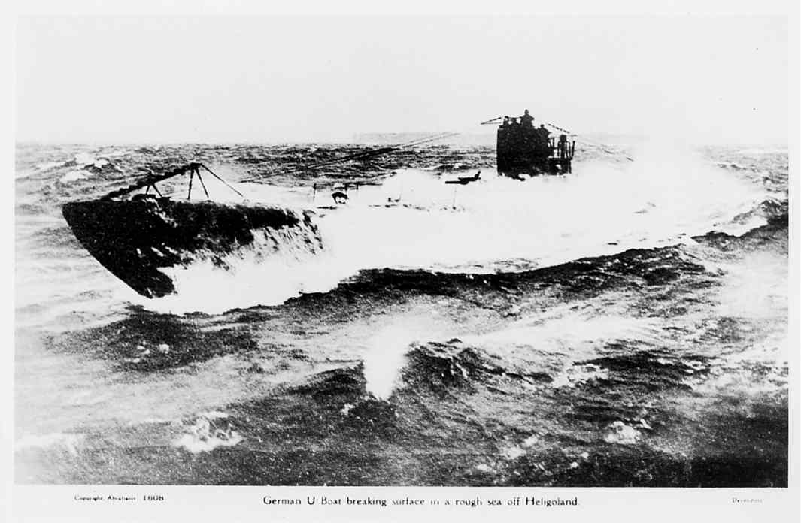

# SteelWolves-AutoResolve
A combat auto-resolver for the board game 'Steel Wolves' -- Markus Broecker 
<mbrckr@gmail.com>

## Introduction
Steel Wolves has a very detailed tactical sub vs convoy attack simulation built
in. However, there were few decision points and lots of die rolling as well as 
drawing chits from up to 14 different cups. The focus of the game was on also 
on the strategic side of the campaing and resolving the tactical combat was 
taking _a lot_ of time. While the previous game 'Silent War' had an optional 
quick resolve rule for combat, there was no such thing for 'Steel Wolves'.

This program tries to implement an auto-resolver for the tactical combat in 
'Steel Wolves'. It is built upon a few assumptions and simplifications of how 
this pogram will behave in during the combat phase (call it 'doctrine' or 
'rules of engagment' if you will). It can be either used stand-alone to resolve 
a single combat or used repeatedly to build engagement statistics which, in 
turn, can be compiled into easy-to-use tables. The focus of this project is on 
the creation of these tables.

The basic idea is then to run the combat resolution hundreds of times with a 
specific configuration, record the result (and its statistical properties, such
as mean, median, standard deviation and so on) and do this for many different
configurations. These results will then be compiled into an abbreviated combat 
table. 

## Performance
First runs indicate that a run of 500 combat resolutions can be easily computed
on a lower-end laptop in less than a second. 

## Assumptions
The following assumptions are made:
- Only small and large (C1/C2) convoys are currently supported
- All merchants are modeled on the british merchant fleet, especially concerning 
tonnage and defense values
- Destroyer values are randomly generated; while their tonnage is either 1 or 2
, their defense and asw values are uniformly distributed between 1 and 3
- Submarines will disengange as soon as they are either spotted or damaged
- Submarines will attack highest-value targets (sorted by tonnage, then defense
) first and parcel out their attack value in '4's
- Submarines will never engage undetected targets
- Wolfpacks are currently unsupported

## Building and Running
The script is currently a single-file python script. Run it using your normal 
way of executing python scripts on your system (eg `python ./ccomputer.py`).

There are no command-line parameters yet. Changing the values of combat 
resolution and parameters is currently achieved by hacking the code. 

To create the table 3 steps are involved:
1. The combat result statistics must be created
2. These statistics are analyzed and interpreted into linear tables
3. These tables must be manually aligned to create DRMs 

### Running the Combat Simulation
`ccomputer.py` simulates the combat between a single submarine and a convoy 
thousands of times and writes the output to a file. Important parameters for 
the simulation include:
- Parameters of the submarine (attack, defense, tac)
- Skipper rating (from 0 to +2)
- Convoy size (C1 or C2)
- War period, global ASW level and torpedo quality

The output is a single csv file that contains the result each combat. The 
submarines in this combat are named consecutively, not historically. Each line/
result contains the number of ships sunk and damaged, total tonnage sunk, 
whether the sub got sunk, damaged, spotted or is returning to base. These files
can either be loaded into an external program, such as Excel, or be processed 
in the next step.

### Analyzing the Data

### Aligning the Tables
Work-in-progress -- currently based on 'gut feel' and fudging 

## Results

The tables are split between war periods and then grouped per submarine 
based on similar values (eg VIIB and VIIC together).

## Future Work
The current version of the simulator consist of multipple python scripts that 
grew beyond the comfort of a simple, single-file script. The next version 
should be a conversion to Javascript which then can be embedded into a website. 
This will have the advantage that the combat resolver can be called from any 
browser (think cellphone, tablet) during an actual game, similar to a _very_ 
involved die rolling app.
